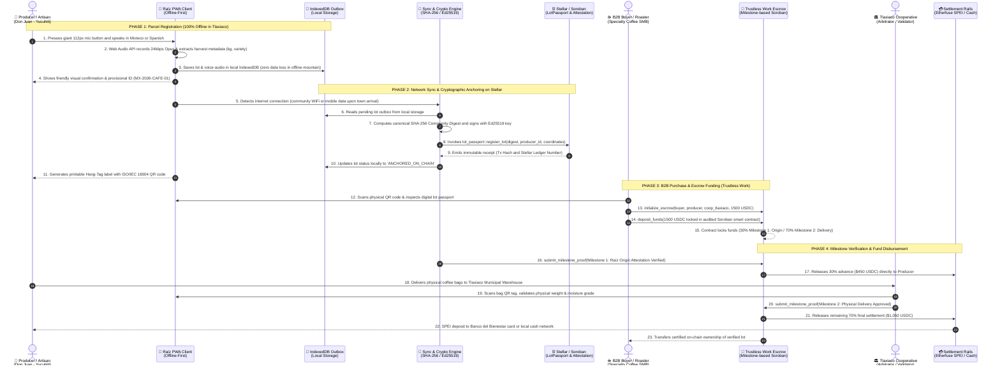

# 🏛️ Raíz Protocol Architecture Specification
### *Software Architecture & Decentralized Protocol on Stellar & Soroban*

* **Ecosystem:** Stellar Network / Soroban / Drips Network / TecNM Campus Tlaxiaco
* **Architectural Pattern:** Offline-First, Event-Driven, Decoupled Adapter Pattern
* **Associated ADRs:** [ADR-001 (Trustless Work Escrow)](./adr/ADR-001-TRUSTLESS-WORK-ESCROW.md), [ADR-002 (Rural Channels & WhatsApp Decoupling)](./adr/ADR-002-COMMUNICATION-CHANNELS-AND-WHATSAPP-ALTERNATIVES.md)

---

## 📐 1. System Layers Architecture Diagram

```
┌────────────────────────────────────────────────────────────────────────────────────────┐
│                        LAYER 1: MOBILE CLIENT & ACCESSIBILITY                          │
│  - Progressive Web App (PWA) Offline-First (React 19 + Tailwind CSS)                   │
│  - "Elder-Friendly / Modo Abuelo" UI: 112px ergonomic touch targets, zero complex text│
│  - Web Audio API: 24kbps Opus recording and acoustic normalization                     │
│  - Zero-Seed IAM: Physical Community QR Cards and SMS OTP authentication               │
└───────────────────────────────────────────┬────────────────────────────────────────────┘
                                            │
                                            ▼
┌────────────────────────────────────────────────────────────────────────────────────────┐
│                   LAYER 2: DOMAIN CORE & OFFLINE RESILIENCE ENGINE                     │
│  - Offline Storage Outbox: IndexedDB (ACID transactional offline-first storage)        │
│  - SyncEngine: Reactive cryptographic synchronization upon connectivity detection      │
│  - CryptoEngine: Canonical SHA-256 Community Digest calculation and Ed25519 signing    │
│  - QR Engine: Vectorized SVG ISO/IEC 18004 generation for physical Hang-Tag labels     │
└───────────────────────────────────────────┬────────────────────────────────────────────┘
                                            │
                                            ▼
┌────────────────────────────────────────────────────────────────────────────────────────┐
│                     LAYER 3: AUTONOMOUS AI ORACLES & RWA ATTESTATIONS                  │
│  - AIVoiceOracle: Acoustic normalization & semantic parsing (*Tu'un Savi* / Spanish)   │
│  - AIQualityOracle: SCAA defect scoring (>85 specialty grade) & ancestral craft audit  │
│  - AIEUDRSatelliteOracle: Sentinel-2 multispectral geofence anti-deforestation proof   │
│  - Attestation Registry: EAS-equivalent verifiable credentials anchored on Stellar     │
└───────────────────────────────────────────┬────────────────────────────────────────────┘
                                            │
                                            ▼
┌────────────────────────────────────────────────────────────────────────────────────────┐
│                    LAYER 4: SOROBAN SMART CONTRACTS (STELLAR)                          │
│  ┌─────────────────────────┐ ┌─────────────────────────┐ ┌──────────────────────────┐ │
│  │   lot_passport (Rust)   │ │ attestation_registry(RS)│ │  TRUSTLESS WORK ESCROW   │ │
│  │ Immutable lot identity  │ │ On-chain schema registry│ │ Milestone-based Soroban  │ │
│  │ & Tlaxiaco origin proof │ │ & decentralized claims  │ │ custody & disbursement   │ │
│  └─────────────────────────┘ └─────────────────────────┘ └──────────────────────────┘ │
└───────────────────────────────────────────┬────────────────────────────────────────────┘
                                            │
                                            ▼
┌────────────────────────────────────────────────────────────────────────────────────────┐
│                     LAYER 5: SETTLEMENT RAILS & LAST-MILE PAYOUT                       │
│  - Etherfuse Anchor: Atomic swap USDC -> MXNe -> Banxico SPEI interbank transfers     │
│  - Financial Inclusion Accounts: Banco del Bienestar, Finabien & Oaxaca Credit Unions  │
│  - Rural cooperative cash distribution network for unbanked smallholders               │
└────────────────────────────────────────────────────────────────────────────────────────┘
```

---

## 🔄 2. End-to-End User and System Interaction Sequence Diagram

The following sequence diagram details the complete flow of events and interactions among the three human actors (**Producer**, **Institutional Buyer**, and **Tlaxiaco Cooperative Validator**) with the client software, offline storage, Stellar ledger anchoring, and the **Trustless Work** smart contract escrow:



### Breakdown of Sequence Phases:

1. **Phase 1 (Parcel Offline Edge):** Don Juan is in the remote mountains of Santa María Yucuhiti without cellular coverage. He opens the Raíz PWA, taps the 112px ergonomic microphone button, and speaks in *Tu'un Savi* (Mixteco). The application captures the audio and harvest metadata locally in IndexedDB with zero dependence on active internet.
2. **Phase 2 (Stellar Ledger Anchoring):** Upon arriving at a connected zone or community WiFi hotspot in Tlaxiaco, the `SyncEngine` processes the outbox, computes the canonical SHA-256 Community Digest, and interacts with Soroban smart contracts, generating the physical QR Hang-Tag label for the coffee sacks.
3. **Phase 3 (B2B Escrow with Trustless Work):** An ethical buyer or roaster in Europe, the US, or Mexico City scans the QR code, reviews verifiable proof of origin and quality, and locks 1,500 USDC in **Trustless Work**'s audited Soroban escrow contract.
4. **Phase 4 (Milestone Disbursement & Delivery):** The farmer immediately receives an automated 30% advance payment ($450 USDC) backed by the certified origin attestation. When physical coffee bags arrive at the Tlaxiaco cooperative, the local validator confirms physical reception, triggering the release of the remaining 70% ($1,050 USDC) via SPEI directly to the farmer's Banco del Bienestar debit card.

---

## 📂 3. Repository Directory Structure (Technical Mapping)

To facilitate onboarding for student-researchers, maintainers, and open-source contributors:

```text
raiz/
├── contracts/                     # Rust smart contracts for Soroban (Stellar)
│   ├── attestation_registry/      # Schema registry & on-chain provenance claims
│   ├── lot_passport/              # Immutable digital passport for agricultural lots
│   ├── perpetual_royalties/       # Secondary market royalty engine for female artisans
│   └── fair_escrow/               # Baseline community escrow implementation
├── docs/                          # Architectural, technical, and field research docs
│   ├── adr/                       # Architecture Decision Records (ADR-001, ADR-002)
│   ├── MVP_SPECIFICATION.md       # Strict MVP specification for Tlaxiaco pilot
│   ├── ARCHITECTURE.md            # This system architecture document
│   ├── PROTOCOL_SPECIFICATION.md  # Cryptographic & smart contract protocol spec
│   └── research/                  # Field research reports & usability interviews in Oaxaca
├── src/
│   ├── components/                # React UI components (PWA / Elder-Friendly Mode)
│   │   ├── ChatScreen.tsx         # Voice registration & conversational interface
│   │   ├── DigitalPassportScreen.tsx # Public verified lot passport viewer
│   │   ├── ArtisanQrTagModal.tsx  # Physical QR Hang-Tag label generator
│   │   └── TopAppBar.tsx          # Main header & role switcher
│   ├── core/                      # Pure domain core (isolated from UI framework)
│   │   ├── ai/                    # AI Oracles (Voice STT, SCAA Quality, EUDR Satellite)
│   │   ├── auth/                  # Zero-Seed identity & Community QR card engine
│   │   ├── blockchain/            # Soroban RPC adapter & Trustless Work Escrow adapter
│   │   ├── crypto/                # Canonical SHA-256 digest & Ed25519 signing
│   │   ├── settlement/            # Hybrid multi-anchor settlement orchestrator (Etherfuse)
│   │   └── sync/                  # Offline outbox & synchronization engine (IndexedDB)
│   └── tests/                     # Automated unit and system test suites
└── drips.config.json              # Drips Network funding configuration & splits
```

---

## 🔒 4. Trustless Work Escrow Integration

In alignment with [ADR-001](./adr/ADR-001-TRUSTLESS-WORK-ESCROW.md), Raíz Protocol utilizes **Trustless Work**'s audited smart contract infrastructure via the `TrustlessWorkEscrowAdapter`:

1. **Funding:** The institutional buyer deposits USDC or MXNe into the Trustless Work contract.
2. **Milestone 1 (Harvest Advance - 30%):** Automatically released when the smart contract verifies the origin attestation issued by Raíz in Tlaxiaco (`0x01_ORIGIN`).
3. **Milestone 2 (Final Settlement - 70%):** Released when the Tlaxiaco cooperative issues the physical delivery attestation (`0x04_DELIVERY`).
4. **Arbitration:** If discrepancies arise in weight, humidity, or defect score, the municipal cooperative acts as the designated arbitrator within Trustless Work to achieve resolution.

---

## 📡 5. Channel Policy & Offline Resilience

In alignment with [ADR-002](./adr/ADR-002-COMMUNICATION-CHANNELS-AND-WHATSAPP-ALTERNATIVES.md):
* The primary interaction channel is an open **Progressive Web App (PWA)** adhering to W3C standards, completely eliminating dependency on proprietary platforms like WhatsApp, avoiding per-message API fees, and eliminating the risk of arbitrary account bans.
* All data is persisted locally in **IndexedDB** at the edge, synchronizing with the Stellar ledger in atomic batches when connectivity is available.
