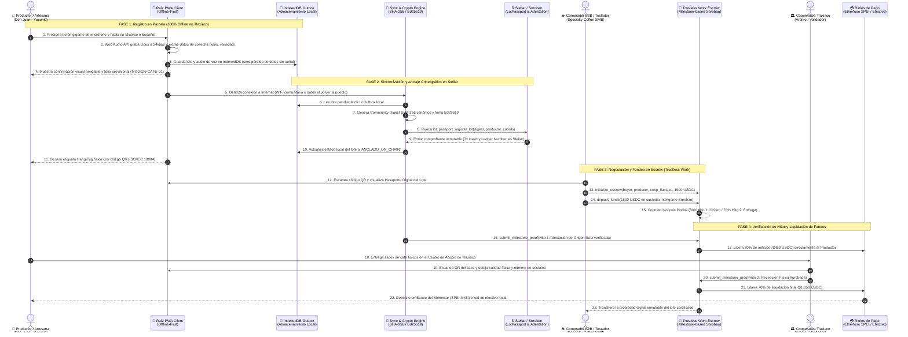

# 🏛️ Especificación de Arquitectura de Raíz Protocol
### *Arquitectura de Software y Protocolo Descentralizado en Stellar & Soroban*

* **Ecosistema:** Stellar Network / Soroban / Drips Network / TecNM Campus Tlaxiaco
* **Diseño Arquitectónico:** Offline-First, Event-Driven, Decoupled Adapter Pattern
* **Documentos de Decisión Asociados:** [ADR-001 (Trustless Work)](./adr/ADR-001-TRUSTLESS-WORK-ESCROW.md), [ADR-002 (Canales Rurales)](./adr/ADR-002-COMMUNICATION-CHANNELS-AND-WHATSAPP-ALTERNATIVES.md)

---

## 📐 1. Diagrama General de Capas del Sistema

```
┌────────────────────────────────────────────────────────────────────────────────────────┐
│                        CAPA 1: CLIENTE MÓVIL Y ACCESIBILIDAD                           │
│  - Progressive Web App (PWA) Offline-First (React 19 + Tailwind CSS)                   │
│  - Interfaz "Modo Abuelo": Botones táctiles gigantes (112px) y cero texto complejo     │
│  - Web Audio API: Grabación y normalización acústica (24kbps Opus)                     │
│  - Autenticación Zero-Seed: Carnet QR Físico Comunitario y OTP SMS                     │
└───────────────────────────────────────────┬────────────────────────────────────────────┘
                                            │
                                            ▼
┌────────────────────────────────────────────────────────────────────────────────────────┐
│                      CAPA 2: NÚCLEO DE DOMINIO Y RESILIENCIA OFFLINE                   │
│  - Offline Storage Outbox: IndexedDB (ACID transaccional sin internet)                 │
│  - SyncEngine: Sincronización criptográfica reactiva al detectar conectividad          │
│  - CryptoEngine: Cálculo de Community Digest SHA-256 canónico y llaves Ed25519         │
│  - QR Engine: Generación vectorial SVG ISO/IEC 18004 para etiquetas Hang-Tag           │
└───────────────────────────────────────────┬────────────────────────────────────────────┘
                                            │
                                            ▼
┌────────────────────────────────────────────────────────────────────────────────────────┐
│                      CAPA 3: ORÁCULOS DE IA Y ATESTACIONES (RWA)                       │
│  - AIVoiceOracle: Normalización acústica y extracción semántica (Mixteco / Español)    │
│  - AIQualityOracle: Evaluación sensorial SCAA (>85 pts) y patrimonio artesanal maestro │
│  - AIEUDRSatelliteOracle: Geocercado Sentinel-2 para cumplimiento anti-deforestación   │
│  - Attestation Registry: Emisión de credenciales verificables tipo EAS para Stellar    │
└───────────────────────────────────────────┬────────────────────────────────────────────┘
                                            │
                                            ▼
┌────────────────────────────────────────────────────────────────────────────────────────┐
│                   CAPA 4: CONTRATOS INTELIGENTES EN SOROBAN (STELLAR)                  │
│  ┌─────────────────────────┐ ┌─────────────────────────┐ ┌──────────────────────────┐ │
│  │   lot_passport (Rust)   │ │ attestation_registry(RS)│ │  TRUSTLESS WORK ESCROW   │ │
│  │ Identidad inmutable del │ │ Esquemas y validación   │ │ Custodia y liberación por│ │
│  │ lote y origen Tlaxiaco  │ │ descentralizada on-chain│ │ hitos verificables       │ │
│  └─────────────────────────┘ └─────────────────────────┘ └──────────────────────────┘ │
└───────────────────────────────────────────┬────────────────────────────────────────────┘
                                            │
                                            ▼
┌────────────────────────────────────────────────────────────────────────────────────────┐
│                       CAPA 5: RIELES DE LIQUIDACIÓN Y ÚLTIMA MILLA                     │
│  - Etherfuse Anchor: Conversión atómica USDC -> MXNe -> Transferencias SPEI Banxico    │
│  - Cuentas de Inclusión: Banco del Bienestar, Finabien y Cajas Populares de la Mixteca  │
│  - Red de transporte y nodos locales de efectivo para campesinos no bancarizados       │
└────────────────────────────────────────────────────────────────────────────────────────┘
```

---

## 🔄 2. Diagrama de Secuencia de Interacción de Usuario y del Sistema (End-to-End)

El siguiente diagrama detalla la secuencia completa de eventos e interacciones de los tres actores humanos (**Productor**, **Comprador Institucional** y **Cooperativa de Tlaxiaco**) con el software cliente, el almacenamiento offline, el anclaje en Stellar y el contrato de custodia de **Trustless Work**:



### Desglose de Fases de la Secuencia:

1. **Fase 1 (Parcela 100% Offline):** Don Juan se encuentra en las montañas de Santa María Yucuhiti sin cobertura celular. Abre la PWA de Raíz, presiona el botón gigante de micrófono (112px ergonómico), habla en *Tu'un Savi* (Mixteco) y la app almacena localmente el audio y los metadatos en IndexedDB.
2. **Fase 2 (Anclaje en Stellar al volver al pueblo):** Al llegar a un punto con señal o WiFi en Tlaxiaco, el `SyncEngine` procesa la outbox, calcula el digest SHA-256 e interactúa con los contratos Soroban de Stellar, emitiendo la etiqueta física con código QR para el saco de café.
3. **Fase 3 (Fondeo B2B con Trustless Work):** El comprador institucional en Europa o CDMX escanea el QR, revisa la prueba de origen y calidad, y deposita 1,500 USDC en el contrato de custodia de **Trustless Work** sobre Soroban.
4. **Fase 4 (Liquidación por Hitos y Entrega):** El productor recibe un anticipo del 30% ($450 USDC) garantizado por la atestación de origen. Al entregar los sacos en la cooperativa de Tlaxiaco, el árbitro comunal confirma la recepción física y el contrato de Trustless Work libera automáticamente el 70% restante ($1,050 USDC) vía SPEI hacia su tarjeta del Banco del Bienestar.

---

## 📂 3. Estructura de Directorios del Repositorio (Mapeo Técnico)

Para facilitar la incorporación de colaboradores y estudiantes del TecNM, el monorepo organiza sus responsabilidades de forma modular:

```text
raiz/
├── contracts/                     # Contratos inteligentes en Rust para Soroban
│   ├── attestation_registry/      # Registro de esquemas y atestaciones de origen
│   ├── lot_passport/              # Pasaporte digital inmutable de cosechas
│   ├── perpetual_royalties/       # Motor de regalías para artesanas (8% / 2%)
│   └── fair_escrow/               # Implementación base de custodia comunitaria
├── docs/                          # Documentación arquitectónica y de campo
│   ├── adr/                       # Architecture Decision Records (ADR-001, ADR-002)
│   ├── MVP_SPECIFICATION.md       # Especificación estricta del MVP para Tlaxiaco
│   ├── ARCHITECTURE.md            # Este documento de arquitectura
│   └── research/                  # Reportes de investigación de campo en Tlaxiaco
├── src/
│   ├── components/                # Componentes React de UI (PWA / Modo Abuelo)
│   │   ├── ChatScreen.tsx         # Interfaz conversacional y registro por voz
│   │   ├── DigitalPassportScreen.tsx # Visualizador público del Pasaporte Digital
│   │   ├── ArtisanQrTagModal.tsx  # Generador de etiquetas físicas QR (Hang-Tag)
│   │   └── TopAppBar.tsx          # Cabecera principal con selector de roles
│   ├── core/                      # Lógica de dominio pura (desacoplada de UI)
│   │   ├── ai/                    # Oráculos de IA (Voz, Calidad SCAA, Satélite EUDR)
│   │   ├── auth/                  # Motor de identidad Zero-Seed y carnet QR
│   │   ├── blockchain/            # Adaptadores Soroban y Trustless Work Escrow
│   │   ├── crypto/                # Generación de SHA-256 canónico y firmas
│   │   ├── settlement/            # Orquestador de liquidación híbrida (Etherfuse/SPEI)
│   │   └── sync/                  # Motor de sincronización offline (IndexedDB)
│   └── tests/                     # Suite completa de pruebas unitarias y de sistema
└── drips.config.json              # Configuración de splits para financiamiento Drips
```

---

## 🔒 3. Integración con Trustless Work

Siguiendo el estándar fijado en el [ADR-001](./adr/ADR-001-TRUSTLESS-WORK-ESCROW.md), el protocolo no reinventa contratos de custodia de fondos, sino que consume la infraestructura de **Trustless Work** a través de la clase `TrustlessWorkEscrowAdapter`:

1. **Depósito:** El comprador institucional deposita USDC o MXNe en el contrato de Trustless Work.
2. **Hito 1 (Anticipo de Cosecha - 30%):** Se libera automáticamente cuando el smart contract verifica la atestación de origen emitida por Raíz en Tlaxiaco (`0x01_ORIGIN`).
3. **Hito 2 (Liquidación Final - 70%):** Se libera cuando la cooperativa de Tlaxiaco emite la atestación física de recepción (`0x04_DELIVERY`).
4. **Arbitraje:** Si el café presenta discrepancia de humedad o peso, la cooperativa comunitaria actúa como árbitro predefinido en Trustless Work para mediar.

---

## 📡 4. Política de Canales y Resiliencia Offline

Siguiendo el [ADR-002](./adr/ADR-002-COMMUNICATION-CHANNELS-AND-WHATSAPP-ALTERNATIVES.md):
* El canal primario es una **Progressive Web App (PWA)** estándar W3C, eliminando la dependencia de WhatsApp, los costos de la API de Meta y las restricciones de conectividad en montaña.
* Los datos se persisten en **IndexedDB** localmente y se transfieren a Stellar en lotes atómicos criptográficos cuando el dispositivo detecta conexión.
