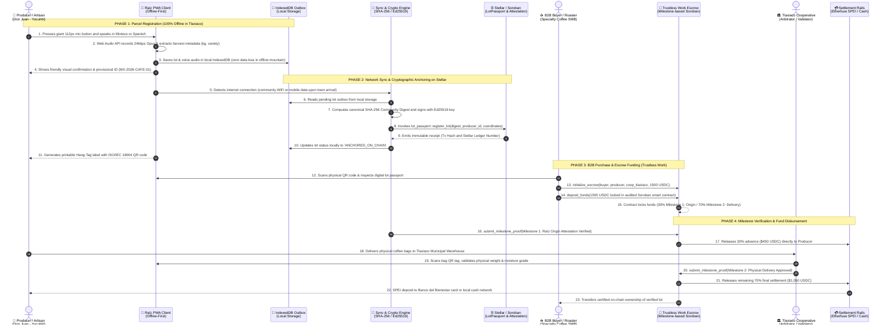

# 🌾 Official Validated MVP Specification: Raíz Protocol
### *Traceability, Visibility, and Verifiable Provenance in Tlaxiaco, Oaxaca*

* **Version:** 1.2.0 (Release Candidate MVP)
* **Governing Body:** Student-Researchers & Faculty at TecNM Campus Tlaxiaco
* **Ecosystem:** Stellar Network / Soroban Smart Contracts / Drips Network / Tech Rebel

---

## 🎯 1. Strict MVP Scope Definition

In accordance with mentor recommendations (Alberto Chaves and Brandon), the Raíz MVP **strictly scopes its boundaries** to prevent feature creep and ensure rigorous, definitive validation in the field:

> **MVP Mission Statement:**  
> *"Empower smallholder coffee farmers and indigenous textile artisans in the region of Tlaxiaco, Oaxaca with an offline-first tool that guarantees harvest traceability, commercial visibility for their craftsmanship, and mathematical proof of origin anchored on the Stellar blockchain."*

The MVP exclusively addresses **three core pillars**:

```
                       ┌───────────────────────────────────────────────┐
                       │               RAÍZ PROTOCOL MVP               │
                       │             (Tlaxiaco, Oaxaca)                │
                       └───────────────────────┬───────────────────────┘
                                               │
           ┌───────────────────────────────────┼───────────────────────────────────┐
           │                                   │                                   │
           ▼                                   ▼                                   ▼
  1. TRACEABILITY                     2. VISIBILITY                       3. VERIFIABLE PROVENANCE
  - Offline parcel registration       - Public Digital Lot Passport       - Canonical SHA-256 Digest
  - Native Mixteco / Spanish voice    - Verifiable technical sheet        - Soroban (Stellar) anchoring
  - Photo, weight & plot capture      - Printed physical Hang-Tag QR      - Tamper-proof anti-coyote audit
```

---

## 📍 2. Pilot Territory & Target Actors

### A. Initial Validation Territory
* **Hub Municipality:** Heroica Ciudad de Tlaxiaco, Oaxaca, Mexico.
* **Pilot Communities:**
  1. **Santa María Yucuhiti:** High-altitude specialty coffee region (1,600 to 2,000 MASL), cultivating Typica, Bourbon, and Pluma Hidalgo varieties.
  2. **San Cristóbal Amoltepec:** Indigenous textile artisan community renowned for backstrap loom weaving and natural ancestral dyes.
  3. **San Agustín Tlacotepec:** Traditional smallholder coffee growers and raw wild-flower honey producers.

### B. The 3 MVP Actors

| Actor | Identity | Interaction with MVP |
| :--- | :--- | :--- |
| **1. Producer / Artisan** | Rural smallholder (median age 62, speaks *Tu'un Savi* or rural Spanish). | Speaks via voice or taps large 112px touch targets in the PWA to register lots without entering passwords. Receives a physical QR Hang-Tag label. |
| **2. Cooperative / Community Validator** | Tlaxiaco cooperative warehouse managers or TecNM resident student-researchers. | Validates physical delivery of coffee bags at the collection hub and co-signs the reception attestation. |
| **3. Institutional Buyer (SMB)** | Specialty coffee roasters and ethical boutiques across Mexico, the US, and Europe. | Scans the bag QR label, audits the digital passport, and locks payments into the Trustless Work Soroban Escrow. |

---

## 🛠️ 3. End-to-End User Flow (Step-by-Step MVP)

### User and System Interaction Sequence Diagram



### Step 1: On-Parcel / Workshop Capture (100% Offline Resilience)
1. The farmer opens the **Raíz PWA** on their smartphone (or meets with a TecNM field promoter).
2. Taps the 112px ergonomic microphone button and dictates harvest details:  
   *Mixteco example:* `"Kuni yu una kiti café"` / *Spanish example:* `"120 kilos de café pergamino lavado en Yucuhiti"`.
3. The application securely writes the record to **IndexedDB**, guaranteeing zero data loss even in mountain valleys without cellular coverage.

### Step 2: Digital Lot Passport & Cryptographic Anchoring
1. The `CryptoEngine` creates a canonical **SHA-256 Community Digest** binding:
   * Unique Lot ID (`MX-OAX-TLAX-2026-CAFE-01`).
   * Producer identity and obfuscated parcel geocoordinates.
   * Botanical variety, altitude, and harvest timestamp.
2. Upon sensing an active internet connection (community WiFi or mobile data upon returning to town), the `SyncEngine` anchors the digest onto the `LotPassport` contract on **Stellar / Soroban**.

### Step 3: Physical Labeling via QR Code (ISO/IEC 18004 Hang-Tag)
1. The application renders an SVG Hang-Tag label containing the vectorized QR code.
2. The QR tag is physically attached to the jute coffee bag or stitched to the textile.
3. The QR code resolves directly to the immutable public Digital Passport.

### Step 4: Public Verification & Milestone Settlement
1. The buyer (roaster or boutique importer) scans the QR code with any standard smartphone without installing third-party apps.
2. The viewer reveals:
   * Origin photo and native audio introduction by the producer.
   * SCAA cupping score, moisture level, and zero-deforestation proof.
   * Verifiable transaction hash and block ledger number on Stellar Horizon.
3. Payment executes via **Trustless Work**'s Soroban escrow contract, releasing funds directly into the producer's account or debit card without exploitative middlemen.

---

## 📊 4. MVP Success & Field Validation Metrics

1. **50 Active Producers in Tlaxiaco:** Formal onboarding and registration of at least 50 real agricultural and artisanal lots during the 2026 harvest cycle.
2. **0% Offline Data Loss:** 100% data persistence rate when capturing lots in zero-connectivity terrain.
3. **Registration Time < 3 Minutes:** A smallholder can complete a full lot registration in under 180 seconds using voice input.
4. **Zero-Seed-Phrase Dependency:** 0% of rural producers forced to write down or memorize 24-word English seed phrases.
5. **Immutable Stellar Attestation:** 100% of validated lots anchored with a cryptographic hash on Soroban.
