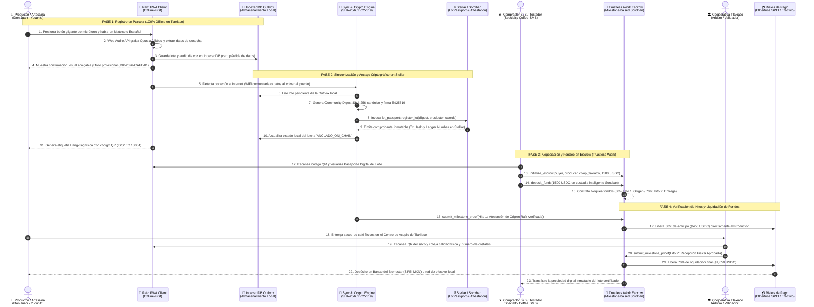

# 🌾 Especificación Oficial del MVP Validable: Raíz Protocol
### *Trazabilidad, Visibilidad y Origen Verificable en Tlaxiaco, Oaxaca*

* **Versión:** 1.2.0 (Release Candidate MVP)
* **Entidad Responsable:** Estudiantes Investigadores y Profesores del TecNM Campus Tlaxiaco
* **Ecosistema:** Stellar Network / Soroban Smart Contracts / Drips Network / Tech Rebel

---

## 🎯 1. Definición del Alcance Estricto del MVP

En alineación con las recomendaciones de los mentores (Alberto Chaves y Brandon), el MVP de Raíz **delimita estrictamente su alcance** para evitar la dispersión de esfuerzos y garantizar una validación contundente en el territorio:

> **Declaración de Misión del MVP:**  
> *"Dotar a los pequeños productores de café y artesanas textiles de la región de Tlaxiaco, Oaxaca, de una herramienta offline-first que garantice la trazabilidad de sus cosechas, la visibilidad comercial de su trabajo y la prueba matemática inmutable de su origen en la blockchain de Stellar."*

El MVP se enfoca en resolver **tres pilares fundamentales**:

```
                       ┌───────────────────────────────────────────────┐
                       │               MVP RAÍZ PROTOCOL               │
                       │             (Tlaxiaco, Oaxaca)                │
                       └───────────────────────┬───────────────────────┘
                                               │
           ┌───────────────────────────────────┼───────────────────────────────────┐
           │                                   │                                   │
           ▼                                   ▼                                   ▼
  1. TRAZABILIDAD                     2. VISIBILIDAD                      3. ORIGEN VERIFICABLE
  - Registro en parcela sin señal     - Pasaporte Digital del Lote        - Hash SHA-256 canónico
  - Voz en Mixteco o Español          - Ficha técnica pública             - Anclaje en Soroban (Stellar)
  - Captura de fotos y kilos          - Código QR físico impreso          - Inmunidad contra coyotaje
```

---

## 📍 2. Territorio y Usuarios Objetivo del Piloto

### A. Territorio de Validación Inicial
* **Municipio Sede:** Heroica Ciudad de Tlaxiaco, Oaxaca, México.
* **Comunidades Piloto:**
  1. **Santa María Yucuhiti:** Zona cafetalera de alta especialidad (1,600 a 2,000 msnm), variedades Typica, Bourbon y Pluma Hidalgo.
  2. **San Cristóbal Amoltepec:** Comunidad artesanal de telar de cintura y bordados tradicionales con tintes naturales.
  3. **San Agustín Tlacotepec:** Colectivo de cafeticultores tradicionales y productores de miel virgen de campanilla.

### B. Los 3 Actores del MVP

| Actor | Quién es | Su interacción con el MVP |
| :--- | :--- | :--- |
| **1. Productor / Artesana** | Campesinos (promedio 62 años, hablantes de Tu'un Savi o español rural). | Hablan por voz o tocan botones gigantes en la PWA para registrar su lote sin escribir contraseñas. Reciben su etiqueta QR física. |
| **2. Cooperativa / Validador Comunitario** | Directivos de la cooperativa de Tlaxiaco o estudiantes residentes del TecNM. | Cotejan la entrega física del lote en el centro de acopio y firman la atestación de recepción. |
| **3. Comprador Institucional (SMB)** | Tostadurías de especialidad e importadores éticos en México, EE.UU. o Europa. | Escanean el QR del lote, inspeccionan la ficha de trazabilidad y depositan en el Escrow de Trustless Work. |

---

## 🛠️ 3. El Flujo de Usuario Paso a Paso (Paso a Paso del MVP)

### Diagrama de Secuencia de Interacción de Usuario y del Sistema



### Paso 1: Captura en Parcela / Taller (Resiliencia 100% Offline)
1. El productor abre la **PWA de Raíz** en su smartphone básico (o acude con un promotor del TecNM).
2. Presiona el botón gigante de micrófono (112px ergonómico) y dicta los datos de su cosecha:  
   *Ejemplo en Mixteco:* `"Kuni yu una kiti café"` / *En Español:* `"120 kilos de café pergamino lavado en Yucuhiti"`.
3. La aplicación almacena el registro localmente en **IndexedDB**, garantizando cero pérdida de datos aunque no haya señal celular en el cafetal.

### Paso 2: Generación del Pasaporte Digital y Anclaje Criptográfico
1. El motor criptográfico (`CryptoEngine.ts`) genera un **Community Digest SHA-256 canónico** vinculando:
   * Código de lote unívoco (`MX-OAX-TLAX-2026-CAFE-01`).
   * Nombre de la familia productora y coordenadas protegidas de la parcela.
   * Variedad botánica, altitud y fecha de cosecha.
2. Al detectar señal de internet (WiFi comunitaria o red móvil al volver al pueblo), el motor de sincronización (`SyncEngine.ts`) ancla el digest en el smart contract `LotPassport` en **Stellar / Soroban**.

### Paso 3: Etiquetado Físico con Código QR (Hang-Tag ISO/IEC 18004)
1. La aplicación genera e imprime una etiqueta física resistente con el código QR vectorizado.
2. El QR se cose directamente al saco de café de yute o a la prenda textil.
3. El código QR contiene la URL pública canónica que apunta al Pasaporte Digital inmutable.

### Paso 4: Verificación Pública y Liquidación Condicionada
1. El comprador (tostador o cliente final) escanea el QR con cualquier teléfono sin instalar apps.
2. Visualiza:
   * Foto y audio en lengua originaria del productor.
   * Puntaje de calidad y certificación de no deforestación.
   * Transacción y bloque verificado en Stellar Horizon/Soroban.
3. El pago se ejecuta a través del contrato de custodia de **Trustless Work**, liberando el dinero directamente a la cuenta o billetera del campesino sin intermediarios usureros.

---

## 📊 4. Métricas de Éxito del MVP (Validación en Campo)

1. **50 Productores Activos en Tlaxiaco:** Registro formal de al menos 50 lotes reales durante el ciclo de cosecha 2026.
2. **0% Pérdida de Datos en Desconexión:** 100% de efectividad de guardado en parcelas sin señal celular.
3. **Tiempo de Registro < 3 Minutos:** Un productor puede registrar su lote completo en menos de 180 segundos por voz.
4. **Cero Dependencia de Frases Semilla (Zero-Seed):** 0% de campesinos obligados a escribir o memorizar contraseñas de 24 palabras en inglés.
5. **Atestación Inmutable en Stellar:** Cada lote cuenta con un hash verificable en Soroban Testnet/Mainnet.
